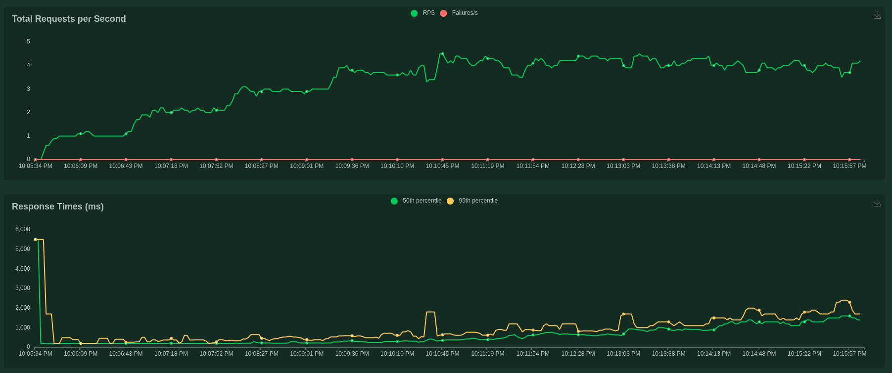
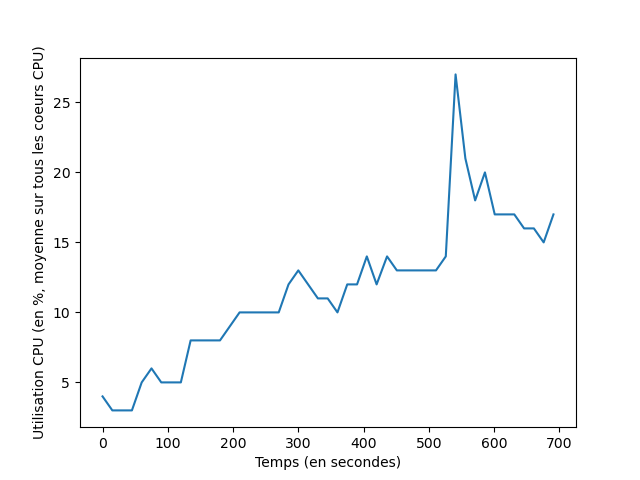

# Python Project: Serving API

In this project, we define an API to make inferences to a trained model.
We first load the trained model along with its weights and we make it available
through an API.

The project's tech stack is composed of:
- Docker for containerization
- Flask for the development of the web app
- gunicorn as WSGI
- pytest for unit tests
- Locust for load tests

We've added a simple layer of authentication along with data validation.
We've also added a logging module, an error handling module along with a test module (for unit tests and load tests)

## Create a virtual environment
Before anything, you should install the requirements
```bash
python3 -m venv venv
source venv/bin/activate
pip install -r src/requirements.txt
```

## Run the Application Locally
Build the docker image and run it with the following command 
(Note: the start may take a few minutes due to the download of the model's weights):
```bash
make build
make run
```

Export the API key (we set the API key as admin:admin for this project)
```bash
export API_KEY=$(echo -n "admin:admin" | base64)
```

You can now send requests by running the following command:

```bash
curl -X 'POST' \
'http://localhost:5000/api/v1/inference/sentiment_analysis' \
-H 'accept: application/json' \
-H "Authorization: Basic $API_KEY" \
-H 'Content-Type: application/json' \
-d '{
"sentence": "i love you"
}'
```

Example of output:

```
{
"sentiment": "POSITIVE",
"confidence": 0.98
}
```

## Run unit tests
```bash
make test
```

## Run load test
First, you need to export the API key as follows:
```bash
export API_KEY=$(echo -n "admin:admin" | base64)
```

Now, run the distributed locust environment with:
```bash
docker-compose up --scale worker=8
```
You can now access locust's interface and run the test at: http://localhost:8089/

## Load test results
We ran the tests with 8 workers (since our local machine has 8 CPU cores)
The response time along with the CPU usage during the load tests are shown in the images below.





We can see that both CPU usage and response time increase as the number of requests per second increases.

However, we weren't able to go higher than 4 requests per second with this configuration since the API call is blocking.

In the future, this could be solved by using a message broker for example.